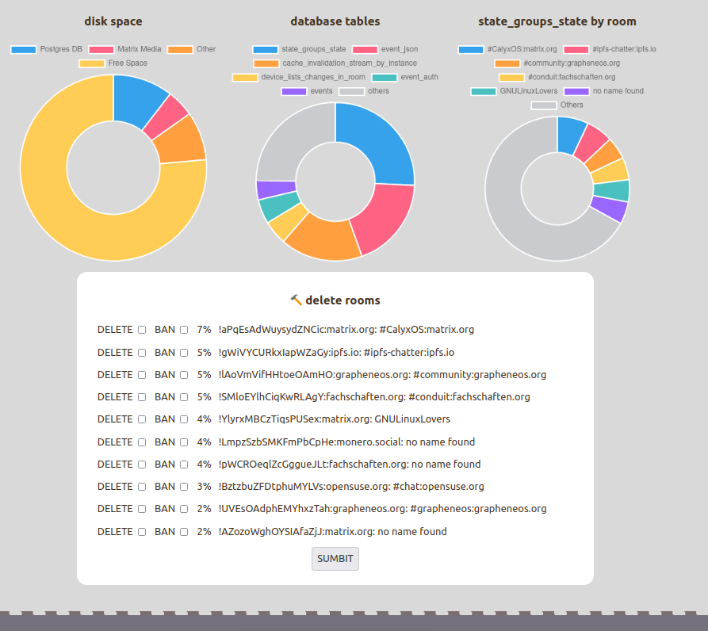

## matrix-synapse-diskspace-janitor


_toilets and boilers, boilers and toilets_



-------------

> We did come up with some shell scripts to handle this, but it was an annoying recurring manual maintenance burden.  Due to the [complicated, multi-step nature of the cleanup process](https://picopublish.sequentialread.com/files/matrix-manual-room-bonk.txt),  I ended up creating an application to handle it instead of continuing to try to script it.  Yes, its probably overkill, but it was fun. And who knows, maybe it can be useful to someone else. 

-------------

## Configuration Overview


#### `config.json`

```
{
  "FrontendPort": 6712,
  "FrontendDomain": "matrix-diskspace-janitor.cyberia.club",
  "MatrixServerPublicDomain": "cyberia.club",
  "MatrixURL": "http://localhost:8008",
  "AdminMatrixRoomId": "!oAVmChLLsrnfaSubLP:cyberia.club",
  "MatrixAdminToken": "syt_xxxxxxxxxxxxxxxxxxxxxxxxxxxxxxxxxxxxx",
  "DatabaseType": "postgres",

  "DatabaseConnectionString": 
  "host=localhost port=5432 user=synapse_user password=xxxxxxxxxx database=synapse sslmode=disable",

  "MediaFolder": "/var/lib/matrix-synapse",
  "PostgresFolder": "/var/lib/postgresql"
}
```

----------------------

#### `FrontendDomain`

This is the domain under which the janitor web application will be served.

#### `MatrixServerPublicDomain`

This is the domain part of matrix IDs on your homeserver. For example, my matrix ID is `@forestjohnson:cyberia.club` so I use `cyberia.club` as my `MatrixServerPublicDomain`. 

#### `AdminMatrixRoomId`

Users who are in the `AdminMatrixRoomId` private room will be able to log into the tool with their matrix account. (note, the account has to be on the same homeserver)

----------------------


It uses https://git.sequentialread.com/forest/config-lite for its configuration, so you can also use environment variables to configure it, for example, when you are using docker:

```
  blog-external-service2:
    image: matrix-synapse-diskspace-janitor:test
    restart: always
    environment:
      JANITOR_FRONTENDPORT: 6712
      JANITOR_FRONTENDDOMAIN: 'matrix-diskspace-janitor.cyberia.club'
      ... etc
```


## Origin Story

Matrix-synapse (the matrix homeserver implementation) requires a postgres database server to operate. 
It stores a lot of stuff in this postgres database, information about all the rooms that users on the server have joined, etc.

The problem at hand: 

Matrix-synapse stores a lot of data that it has no way of cleaning up or deleting.

Specifically, there is a table it creates in the database called `state_groups_state`:

```
root@matrix:~# sudo -u postgres pg_dump synapse -t state_groups_state --schema-only
--
-- PostgreSQL database dump
--
...

CREATE TABLE public.state_groups_state (
    state_group bigint NOT NULL,
    room_id text NOT NULL,
    type text NOT NULL,
    state_key text NOT NULL,
    event_id text NOT NULL
);
```

I don't understand what this table is for, however, I can recognize fairly easily that it accounts for the grand majority of the disk space bloat of a matrix-synapse instance:

#### top 10 tables by disk space used, cyberia.club instance:


So, I think it's safe to say that if we can cut down the size of `state_groups_state`, then we can solve our disk space issues.

I know that there are other projects dedicated to this, like https://github.com/matrix-org/rust-synapse-compress-state

However, a cursory examination of the data in `state_groups_state` led me to believe maybe there is an easier and better way.

`state_groups_state` _DOES_ have a `room_id` column on it. It's not _indexed_ by `room_id`, but we can still count the # of rows for each room and rank them:

#### top 100 rooms by number of `state_groups_state` rows, cyberia.club instance:


In summary, it looks like 

> **about 90% of the disk space used by matrix-synapse is in `state_groups_state`, and about 90% of the rows in `state_groups_state` come from just a handfull of rooms**.

So from this information we have hatched a plan: 

> _Just delete those rooms from our homeserver _

However, unfortunately the [matrix-synapse delete room API](https://matrix-org.github.io/synapse/latest/admin_api/rooms.html#version-2-new-version) does not remove anything from `state_groups_state`.  

This is similar to the way that the [matrix-synapse message retention policies](https://github.com/matrix-org/synapse/blob/develop/docs/message_retention_policies.md) also do not remove anything from `state_groups_state`.

In fact, probably helps explain why `state_groups_state` gets hundreds of millions of rows and takes up so much disk space: Nothing ever deletes from it!!

We did come up with some shell scripts to handle this, but it was an annoying recurring manual maintenance burden.  Due to the [complicated, multi-step nature of the cleanup process](https://picopublish.sequentialread.com/files/matrix-manual-room-bonk.txt),  I ended up creating an application to handle it instead of continuing to try to script it.  Yes, its probably overkill, but it was fun. And who knows, maybe it can be useful to someone else. 

