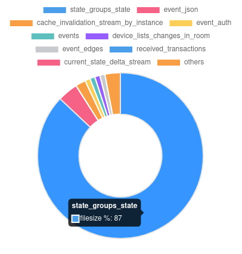

## matrix-synapse-state-groups-state-janitor

Matrix-synapse (the matrix homeserver implementation) requires a postgres database server to operate. 
It stores a lot of stuff in this postgres database, information about all the rooms that users on the server have joined, etc.

The problem at hand: 

Matrix-synapse stores a lot of data that it has no way of cleaning up or deleting.

Specifically, there is a table it creates in the database called `state_groups_state`.   I don't understand what this table is for, however, I can recognize fairly easily that it accounts for the grand majority of the disk space bloat in matrix-synapse:

#### top 10 tables by disk space used:

